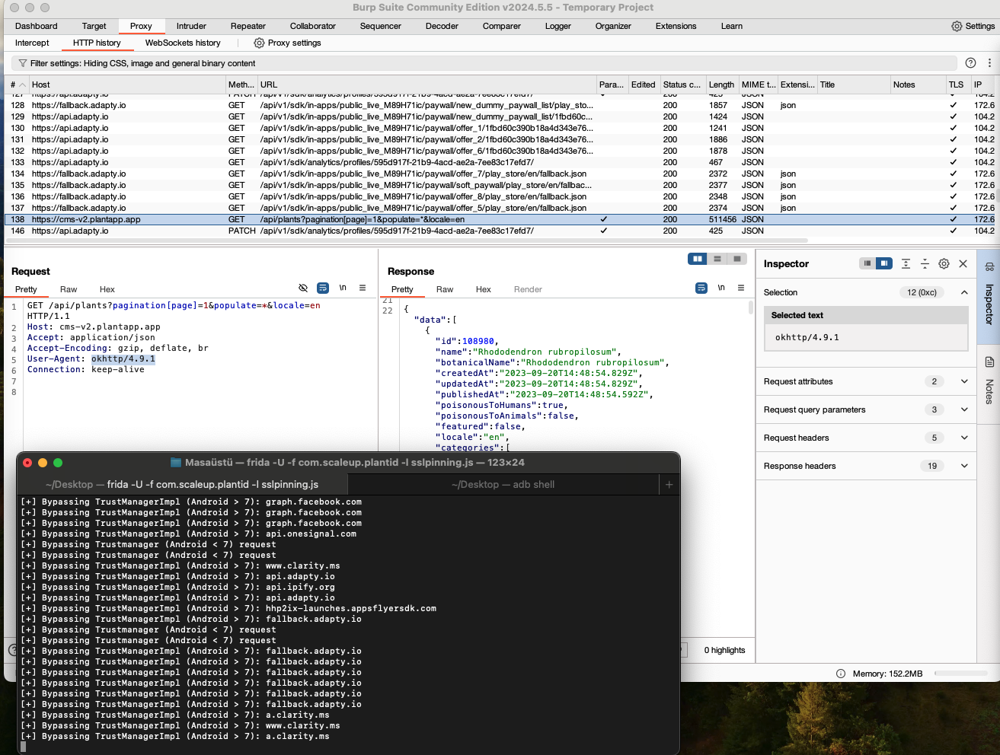

# Plant App - Plant Identifier Unofficial API
Plant App unofficial API, SSL Pinning bypass via frida.


https://plantapp.app/

### Get plants

```java
import com.mtks.PlantAPI;
// https://cms-v2.plantapp.app/api/plants?pagination[page]=2&populate=*&locale=en
PlantAPI plantAPI = new PlantAPI();
int page = 1;
CompletableFuture<String> plants = plantAPI.plant.getPlants();
CompletableFuture<String> plants = plantAPI.plant.getPlants(page);
String response = plants.get();
```
Response:
```json
{
  "data":[
    {
      "id": "...",
      "name": "...",
      "botanicalName": "...",
      "createdAt": "..."
    }
  ]
}
```
--- 
## Intercept Requests via Frida

```shell
frida -U -f com.scaleup.plantid -l sslpinning.js
```

